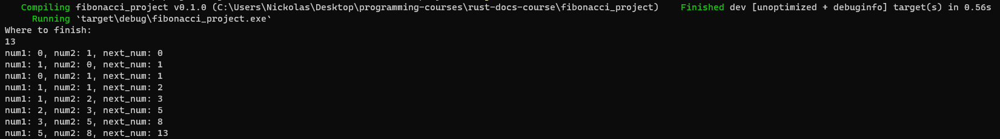

# fibonacci-sequence-rust

Fibonacci sequence in rust. My first rust project :D

Fibonacci sequence is a great project to complete while you are learning a new programming language.
I managed to write this program in rust and it is my first ever project in it.

What I learned from it is how to get user input, work with variables, while loops and functions

## Screenshots

